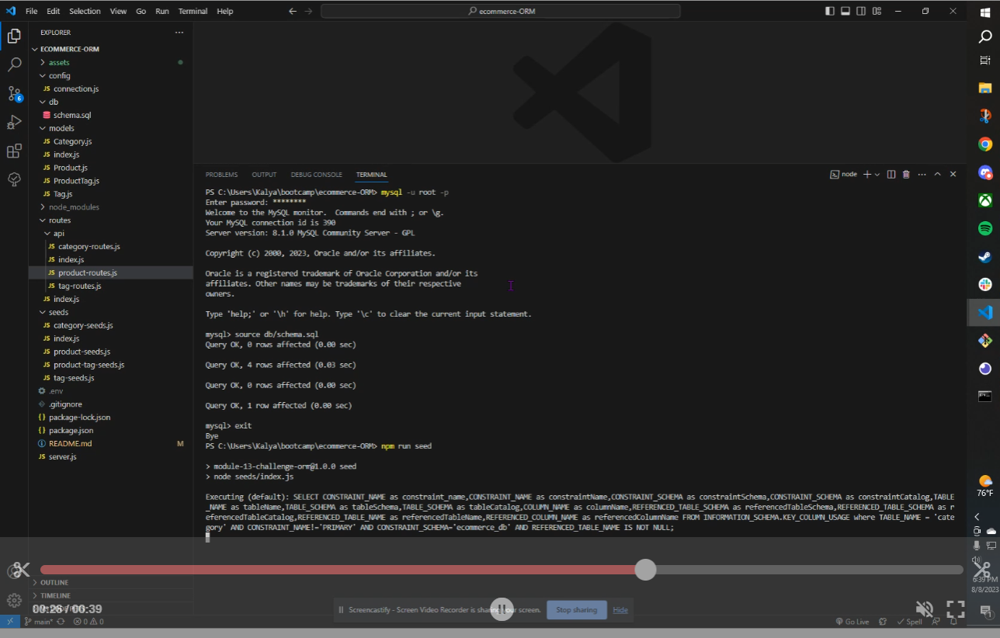
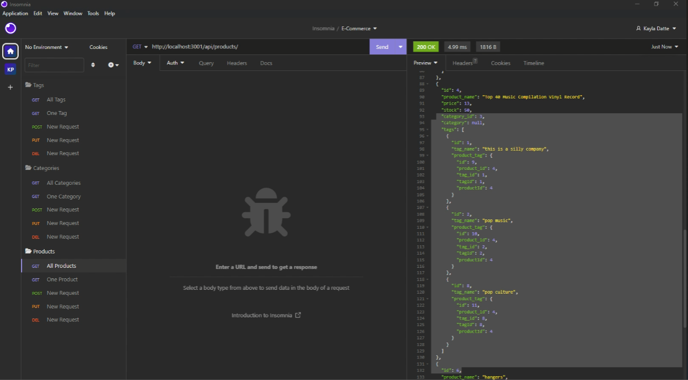

# E-Commerce

## Table of Contents

- [Description](#description)
- [Installation](#installation)
- [Usage](#usage)
- [Credits](#credits)

## Description

This is a database for an e-commerce site that allows the user to organize the inventory data and will allow a front end application to acquire the necessary information from this database.

## Installation

The user will need to run 'npm i', 'npm run seed' and 'npm start' to get the application to run.

## Usage

To use this application you will need to test the route requests in Insomnia (or corresponding application) as demonstrated in the videos linked below:

Walk through video running the schema in MySQL shell:

Walk through of GET ALL, GET ONE, POST, PUT and DELETE requests in Insomnia:

## Credits

Starter code provided by UC Berkeley Extension Program

For any questions, please contact me via the channels below:
* Github: https://github.com/kaylaasana
* E-mail: kayladatte@gmail.com
